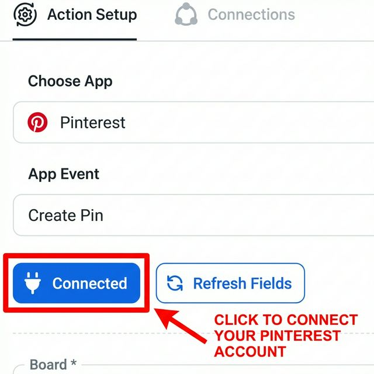
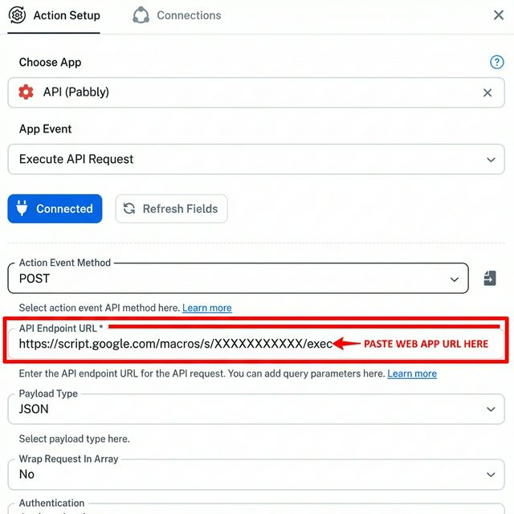

# 🔗 Pabbly Connect Setup Guide

This guide shows you how to configure Pabbly Connect to work with the Pinterest Automation script.

---

## Step 1: Connect Your Pinterest Account (For Each Workflow)

⚠️ **IMPORTANT**: You must connect YOUR Pinterest account in each workflow template you import!

1. Open any step that uses **Pinterest** (e.g., "Create Pin").
2. Click the blue **Connected** button.
3. If not connected, click to authorize your Pinterest account.
4. Once connected, click **Refresh Fields**.

---

## Step 2: Get the Webhook URL from Pabbly

Each Pabbly workflow has a unique **Webhook URL** that you need to copy.

1. Open your Pabbly workflow.
2. Click on the **Trigger** step (first step).
3. Find the **Webhook URL** field.
4. **Copy this URL** (click the copy icon).

5. Paste this URL in your Google Sheet's `Config_Accounts` tab in the appropriate column:
   - **Pabbly Main Webhook** (for Post Pin workflow)
   - **Pabbly List Webhook** (for List Boards workflow)
   - **Pabbly Board Info Webhook** (for Board Details workflow)

---

## Step 3: Set the Web App URL in Pabbly

Your Pabbly workflow needs to call back to your Google Apps Script Web App.

1. In Pabbly, find the **API (Pabbly)** action step (usually at the end).
2. Make sure **Action Event** is set to `Execute API Request`.
3. Find the **API Endpoint URL** field.
4. **Paste your Web App URL** here.

⚠️ **IMPORTANT**: Your Web App URL looks like: `https://script.google.com/macros/s/XXXXX/exec`

Get it from: **Extensions > Apps Script > Deploy > Manage Deployments**

---

## Summary

| What to Copy | Where to Paste |
|--------------|----------------|
| Pabbly Webhook URL | Google Sheet `Config_Accounts` |
| Google Apps Script Web App URL | Pabbly "API Endpoint URL" field |
