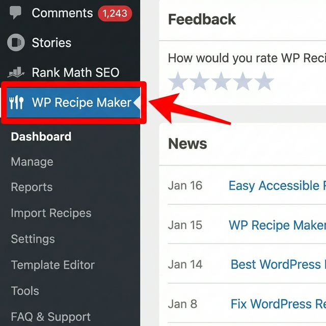
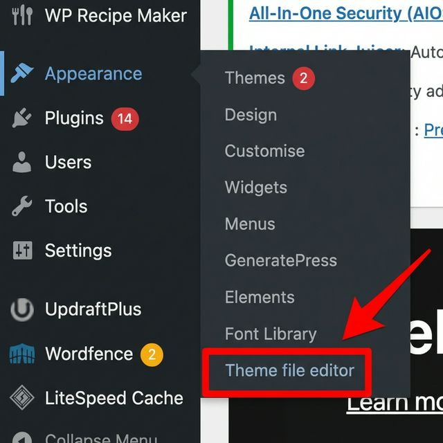
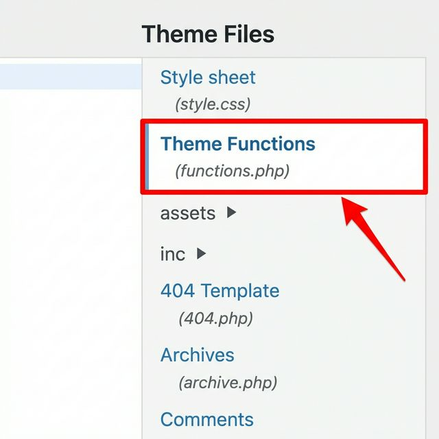
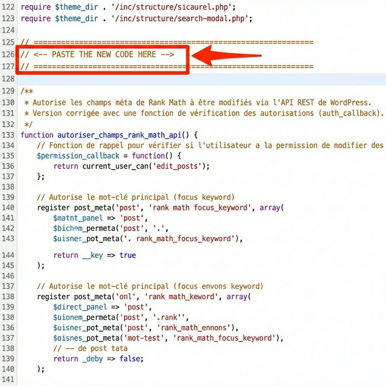
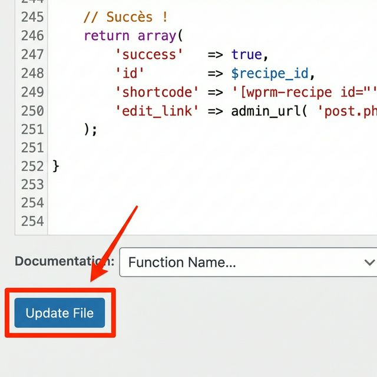

# 🔧 WordPress Setup Guide

This guide explains how to configure your WordPress site to accept data from the Pinterest Automation script.

---

## Step 1: Install Required Plugins

Make sure you have the following plugins installed and activated:
1. **Rank Math SEO** (for metadata)
2. **WP Recipe Maker** (if you are in the food niche)

---

## Step 2: Open THEME FILE EDITOR

We need to add a small code snippet to your theme.

1. Go to **Appearance** in your WordPress sidebar.
2. Click on **Theme file editor**.

---

## Step 3: Select functions.php

1. On the right sidebar under **Theme Files**, find `functions.php`.
2. Click on **Theme Functions (functions.php)**.

---

## Step 4: Paste the Code Snippet

1. Scroll to the very bottom of the file.
2. Paste the content of the `wp-functions-snippet.php` file (found in your Google Drive).

---

## Step 5: Save Changes

1. Click the blue **Update File** button.

✅ **Done!** Your WordPress site is now ready to receive data.
